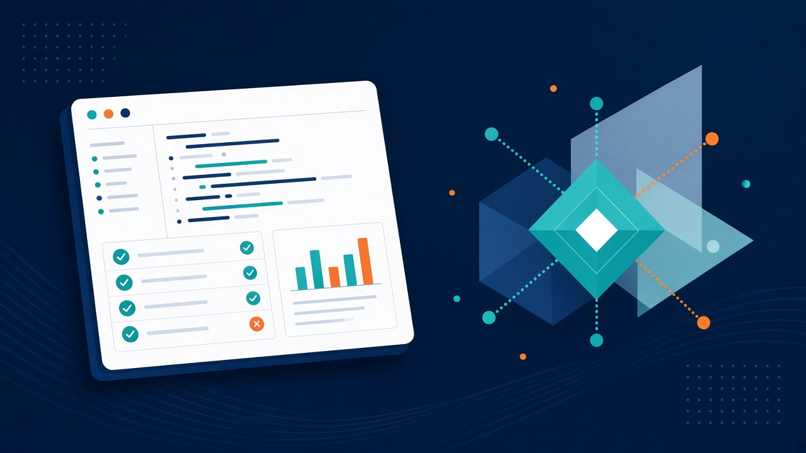

# Skill evals



**Test your agent skills before they embarrass you in production.**

*Created by Shrey Shah*

---

A skill is a folder with a `SKILL.md` that a harness like Claude Code loads when a request matches its description. This course puts one such skill through every eval that exists, in the order you should ask the questions. Free ones first. The ones that cost money only after you've earned the right to ask.

One notebook. Eleven chapters. One skill on trial.

Every cell has stored output from a real run, so you can read the whole thing on GitHub without spending a cent. Run it yourself and it costs a few dollars, takes about ten minutes.

---

## Course parts

| Part | What it asks | Cost |
|------|--------------|------|
| [Part 0: The kit and the ruler](part0_the_kit_and_the_ruler.md) | How do we run the agent with and without the skill, and record what happened? | Free |
| [Part 1: Can the skill even load?](part1_can_the_skill_even_load.md) | Is the SKILL.md well-formed enough to parse? | Free |
| [Part 2: Is the skill hostile?](part2_is_the_skill_hostile.md) | Does it try to read your SSH keys or phone home? | Free |
| [Part 3: Does the description route?](part3_does_the_description_route.md) | Does the description contain the words users type, without stepping on neighbors? | Free + Jev |
| [Part 4: Does the real harness trigger it?](part4_does_the_real_harness_trigger_it.md) | Does the actual software load the skill when it should, and only then? | Agent runs |
| [Part 5: Grading with code](part5_grading_with_code.md) | Does the output follow the rules you can check without a model? | Agent runs |
| [Part 6: Paired A/B comparison](part6_paired_ab_comparison.md) | How much better is the agent with the skill than without? | Agent runs |
| [Part 7: LLM as judge](part7_llm_as_judge.md) | What about the rules only a reader can check? | Judge calls + Jev |
| [Part 8: Trajectory eval](part8_trajectory_eval.md) | Did the agent follow the procedure and respect the prohibitions? | Agent runs |
| [Part 9: Is the lift real?](part9_is_the_lift_real.md) | Was that improvement real or did you get lucky with eight runs? | Free |
| [Part 10: Regression check](part10_regression_check.md) | Did anything get worse since the last run you trusted? | Free |
| [Part 11: What it costs](part11_what_it_costs.md) | What does the improvement cost in tokens, dollars, and time? | Free |

---

## Slides

The deck covers ideas only: what each eval type asks, how it works, and what to watch out for. The code is in the notebook.

- [skill-evals.pptx](deck/skill-evals.pptx) (downloadable)
- [Web version](https://claude.ai/artifact/3nG8nSwm1T3BGjDjffago5) (view in browser)

## Video lectures

Coming soon.

---

## Getting started

```bash
python -m venv .venv && source .venv/bin/activate
pip install -r requirements.txt
claude            # log in once; the live chapters drive the real Claude Code
echo 'TYPESAFE_API_KEY=...' > .env   # for parts 3 and 7 (the Jev sections)
```

Open `skill_evals.ipynb` from this folder in VS Code or JupyterLab. Run all cells. The chapters that start the agent cost a few dollars between them. Everything else is free.

To run without opening anything:

```bash
jupyter execute skill_evals.ipynb --inplace
```

---

## Six rules every eval setup agrees on

These keep coming back, whoever builds the harness.

1. **Test the description before the body.** A skill that doesn't trigger can't help. Run positives and negatives, several times each.

2. **Grade with code wherever you can.** Prove the grader on a known-good and a known-bad answer before trusting it. Use a judge only for what code can't see, and calibrate the judge the same way.

3. **Pair the with and without runs.** Hold everything else fixed. Report the delta with an interval. One run is an anecdote.

4. **Grade the end state and the tool log, not the transcript.** The agent's narration is not evidence.

5. **Keep the skill files physically absent from the baseline workspace.** A flag is not enough. The agent can read files.

6. **Save every raw row.** Later chapters re-read what earlier ones saved. You pay for agent runs once, analyze them as often as you like.

One thing worth knowing: published benchmarks put the average software engineering skill at a few points of lift, and most add nothing measurable. If your A/B says "placebo", the eval may be working fine.

---

## The sample skill

`skills/commit-message/SKILL.md` writes commit messages in a made-up house style: a fixed set of types and scopes, a 50-character subject, a required `Refs: ACME-1234` trailer, output inside a ```text fence, and never run `git commit`.

It's made up on purpose. A skill for something the model already knows shows almost no lift, so you learn nothing from the A/B. The rule: make the task not answerable from memory.

---

## Fixtures

- `fixtures/diffs/` are the four inputs, each with a known right type and scope.
- `fixtures/bad_skills/sneaky-helper/` is a deliberately hostile skill so parts 1 and 2 have something to catch.
- `fixtures/catalog/` are three decoy skills that overlap on vocabulary, so part 3 has something to collide with.

---

## Swapping in your own skill

1. Set `eval_kit.SKILL_DIR` in the notebook's config section to your folder.
2. Rewrite `commit_message_checks.py` with checks and cases for your skill.
3. Replace the fixtures.
4. Edit the prompts specific to commit messages: the routing prompts in part 3, the negative prompts in part 4, the judge assertions in part 7, and the trajectory cases in part 8.

Parts 1, 2, 5, 6, 9, 10, and 11 need no changes.

---

## License

[MIT](LICENSE) - Shrey Shah
